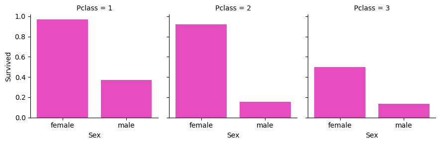

# titanic_survival
# Analysing the features
## 1. Age
The first idea was to check if age is somehow connected with survival rate.
```python
# Check if survival rate is connected with Age
self._facet_grid(plt.hist, col='Survived', x=['Age'])
```
Using `DataAnalyzer` class, we print this graph which shows correlation between Age and survival rate (very young and very old passengers) have better chance to survive than passengers in age `15-45`:


## 2. Sex
As many would think - sex is correlated with survival rate - females had a better chance to survive.
```python
# Check if survival rate is connected with Sex
self._facet_grid(sns.barplot, col='Sex', row='Pclass', x=['Survived'])
```
This plot shows us how the sex of the passengers affected their survival chance:


As we can see - women were 3/4 times more likely to survive the disaster than men. Knowing that, we will include `Sex` feature.
## 3. Pclass
Naturally we would think, that the class of travel would have an impact on the survivability chance (at least back then). This figure shows us the percentage of survival by `Pclass`.


That definitely shows us that `Pclass` feature is worth taking into consideration.

Interesting thing happens when we cross-compare those results with `Sex` feature:



As we can see - the sex of the passengers matters, but its effect on survival chance varies between different `Pclasses`. That's another argument to include `Pclass` feature in our further computation.
## 4. Fare
The next hypothesis is: who paid more had a better chance to survive. This graph shows the effect of `Fare` feature on survivability:


## 5. Embarked